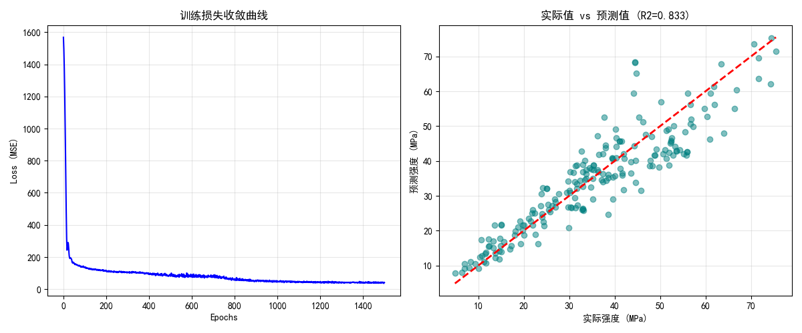

# 神经网络及其应用 - 课程作业 1

欢迎来到我的作业仓库。这里存放了本课程的所有实验代码与报告。

---

## 第一次作业：基于神经网络或线性回归的混凝土抗压强度预测

### 1. 项目简介
本项目旨在利用神经网络模型，根据混凝土的配比（水泥、水、灰等 8 个特征）来预测其最终的抗压强度。这是一个典型的**回归问题**。本项目同时使用了线性回归与神经网络两种方法进行对比预测。

### 2. 文件夹结构说明
* `Homework-01/`: 本次作业的完整资料。
  * `神经网路.ipynb`: 包含数据清洗、模型构建、训练和可视化的 Jupyter Notebook。（使用神经网络的方法）
  * `线性回归.ipynb`: 包含数据清洗、模型构建、训练和可视化的 Jupyter Notebook。（使用线性回归的方法）
  * `线性回归预测结果.pdf`: 包含使用线性回归方法预测的完整运行结果和文字分析的正式报告。
  * `神经网络预测结果.pdf`: 包含使用神经网络方法预测的完整运行结果和文字分析的正式报告。

### 3. 环境要求
* pandas
* numpy
* torch>=2.0.0
* matplotlib
* scikit-learn
* seaborn

### 4. 实验结果展示
在此展示使用神经网络预测的核心成果（详细对比请参阅实验报告）：

#### 模型在测试集上的预测值与真实值对比图：

---

### 5. 结论
最终神经网络模型在测试集上达到了 **$R^2 = 0.85$** 的优异表现。详细的误差分析与模型调优过程请参阅 `神经网络预测结果.pdf`。
